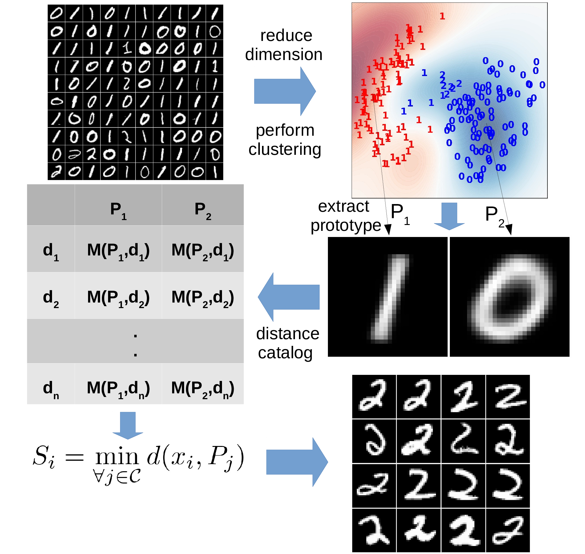

DRAMA
=======

**DRAMA** is a flexible and expendable outlier detection package.

Installation:

The project is hosted on GitHub. Get a copy by running:

``git clone https://github.com/vafaei-ar/drama.git``

Install the package using:

``$ pip install git+https://github.com/vafaei-ar/drama.git``

  

  

  

_Python library for _

**Documentation:** 

You can find some examples:

- [0_mnist_example.ipynb](https://github.com/vafaei-ar/drama/blob/master/notebooks/0_mnist_example.ipynb) 

- [1_Synthetic_signals.ipynb](https://github.com/vafaei-ar/drama/blob/master/notebooks/1_Synthetic_signals.ipynb) 

- [2_event_detection_(Syn-I).ipynb](https://github.com/vafaei-ar/drama/blob/master/notebooks/2_event_detection_(Syn-I).ipynb) .ipynb)

(A more detailed help will be added soon)

**Citing DRAMA:** 

``
@inproceedings{sadr2019flexible,
  title={A Flexible Framework for Anomaly Detection via Dimensionality Reduction},
  author={Sadr, Alireza Vafaei and Bassett, Bruce A and Kunz, Martin},
  booktitle={2019 6th International Conference on Soft Computing \& Machine Intelligence (ISCMI)},
  pages={106--110},
  year={2019},
  organization={IEEE}
}
``
