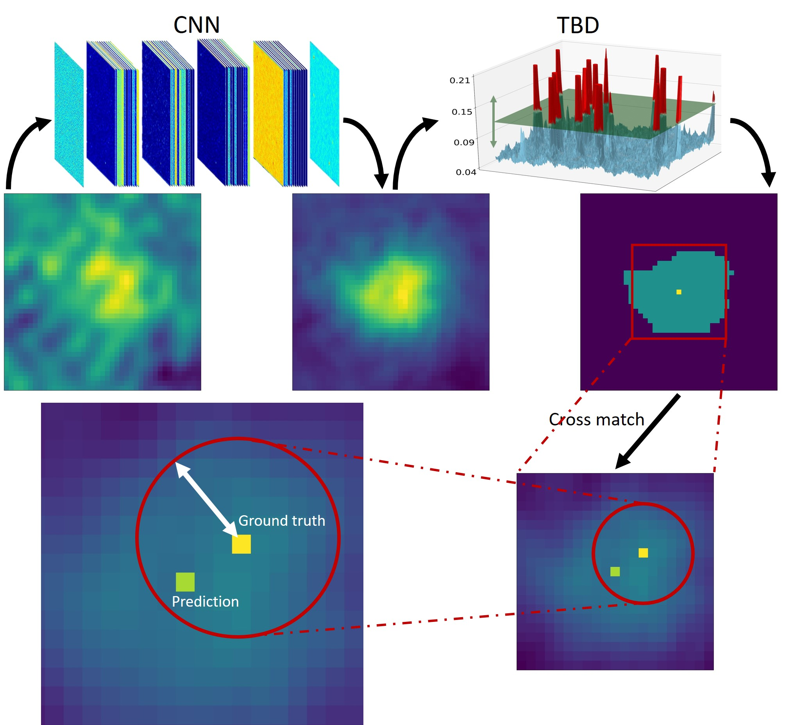
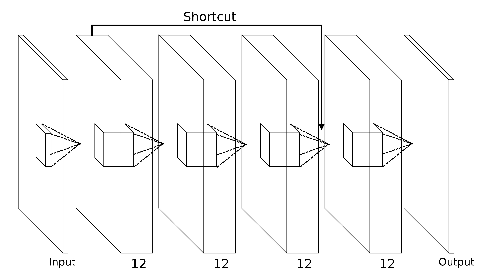

DRAMA
=======

Installation:

The project is hosted on GitHub. Get a copy by running:

$ git clone https://github.com/vafaei-ar/drama.git

Install the package using:

$ cd drama

$ pip install -r requirements.txt 

$ python setup.py install

**DRAMA** is a flexible and expendable outlier detection package for 

  

  

_Python library for _

**Documentation:** http://

**Citing DRAMA:** 
