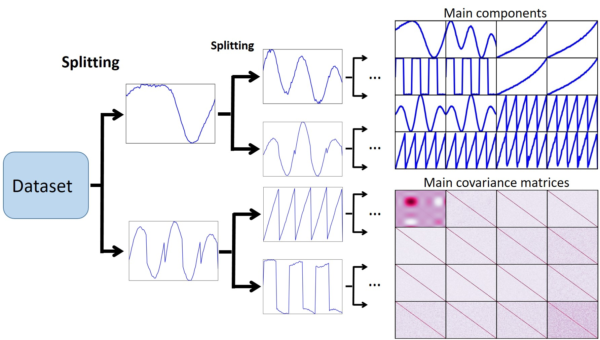

DRAMA
=======

Installation:

The project is hosted on GitHub. Get a copy by running:

Install the package using:

``$ pip install git+https://github.com/vafaei-ar/drama.git``

**DRAMA** is a flexible and expendable outlier detection package.

  

  

_Python library for _

**Documentation:** (will be added soon)

**Citing DRAMA:** 

``
@article{sadr2019flexible,

  title={A Flexible Framework for Anomaly Detection via Dimensionality Reduction},
  
  author={Sadr, Alireza Vafaei and Bassett, Bruce A and Kunz, Martin},
  
  journal={arXiv preprint arXiv:1909.04060},
  
  year={2019}
}
``
